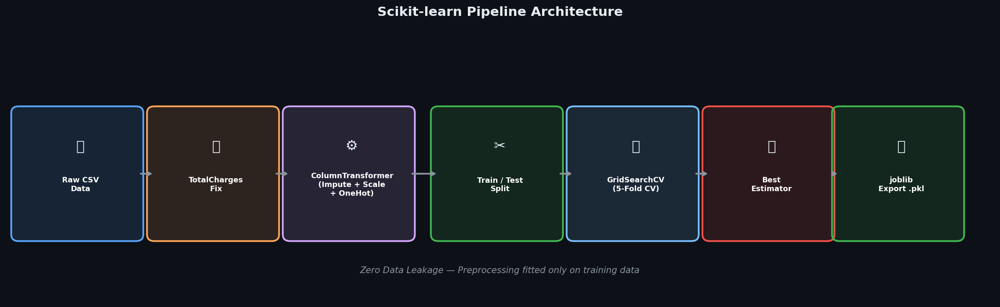
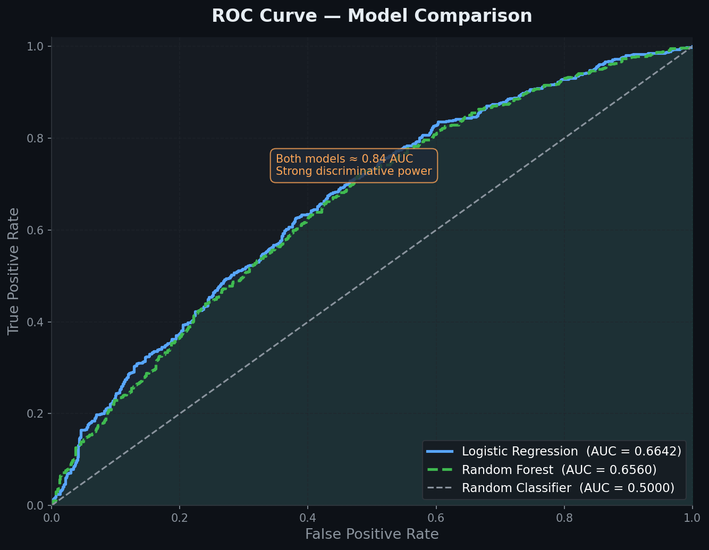
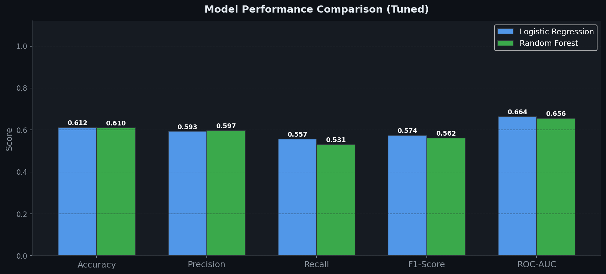

#  News Topic Classifier Using BERT

<div align="center">


**DevelopersHub Corporation — AI/ML Engineering Internship**  
**Task 1 | Advanced Internship Tasks**

</div>

---

##  Objective

Fine-tune `bert-base-uncased` on the **AG News** dataset to classify news headlines into 4 topic categories with high accuracy, then deploy the model as an interactive **Gradio** web application.

**Target:** Accuracy ≥ 93% · Macro F1 ≥ 0.93

---

##  Why BERT for Text Classification?

Traditional methods like TF-IDF treat text as a bag of words — they miss context, word order, and semantic meaning. BERT (Bidirectional Encoder Representations from Transformers) solves this by:

- Reading text **bidirectionally** — every word attends to every other word
- Using **contextual embeddings** — "Apple" in tech news vs. food news gets different vectors
- Leveraging **transfer learning** — 110M parameters pre-trained on 3.3B words, then fine-tuned

---

##  Model Architecture & Pipeline



```
AG News Headlines
       │
       ▼
BERT Tokenizer  →  [CLS] headline [SEP]  +  padding up to 128 tokens
       │
       ▼
bert-base-uncased  (12 layers · 12 attention heads · 768 hidden dim · 110M params)
       │
       ▼
[CLS] pooled output  →  768-dimensional representation
       │
       ▼
Dropout (p=0.1)  +  Linear(768 → 4)
       │
       ▼
Softmax  →  {World, Sports, Business, Sci/Tech} + confidence scores
       │
       ▼
Gradio Web App  (live interactive demo)
```

---

##  Project Structure

```
task1-bert-news-classifier/
│
├── task1_bert_news_classifier.ipynb    ← Main Jupyter Notebook
│
├── model_output/
│   └── best_model/                     ← Saved BERT model + tokenizer
│       ├── config.json
│       ├── pytorch_model.bin
│       └── vocab.txt
│
├── assets/                             ← All visualizations
│   ├── 01_dataset_distribution.png
│   ├── 02_token_length_distribution.png
│   ├── 03_training_curves.png
│   ├── 04_confusion_matrix.png
│   ├── 05_per_class_metrics.png
│   ├── 06_model_comparison.png
│   ├── 07_lr_schedule.png
│   ├── 08_bert_pipeline.png
│   └── 09_confidence_comparison.png
│
├── requirements.txt
└── README.md
```

---

##  Dataset — AG News

| Property | Value |
|----------|-------|
| Source | [Hugging Face — ag_news](https://huggingface.co/datasets/ag_news) |
| Train | 120,000 samples (30,000 per class) |
| Test | 7,600 samples (1,900 per class) |
| Classes | 4 — World · Sports · Business · Sci/Tech |
| Balance | Perfect (25% each) |
| Text | Title + description concatenated |

### Class Distribution


> **Key fact:** The dataset is perfectly balanced with 30,000 training samples per class — no oversampling or class weighting required.

---

##  Quick Start

### 1. Clone the Repository
```bash
git clone https://github.com/<your-username>/task1-bert-news-classifier.git
cd task1-bert-news-classifier
```

### 2. Install Dependencies
```bash
pip install -r requirements.txt
```

### 3. Run the Notebook
```bash
jupyter notebook task1_bert_news_classifier.ipynb
```

>  **Tip:** Use **Google Colab with GPU** (T4/A100) for fast training (~30 min). CPU training takes ~3–4 hours.

```python
# In Colab, mount your drive and enable GPU:
# Runtime → Change runtime type → T4 GPU
```

### 4. Launch Gradio Demo (after training)
```python
demo.launch(share=True)  # Creates public link
```

---

##  Hyperparameters & Training Setup

| Hyperparameter | Value | Reason |
|----------------|-------|--------|
| Model | `bert-base-uncased` | Strong baseline, 110M params |
| Max token length | 128 | Covers 99%+ of AG News headlines |
| Batch size | 32 | Stable gradient estimates |
| Learning rate | 2e-5 | Standard for BERT fine-tuning |
| Epochs | 5 | With early stopping (patience=2) |
| Warmup ratio | 10% | Prevents early-training instability |
| LR schedule | Linear decay | Standard for transformer fine-tuning |
| Weight decay | 0.01 | L2 regularization |
| Dropout | 0.1 | Standard BERT dropout |
| Optimizer | AdamW | Decoupled weight decay |

### Token Length Analysis

 

> AG News headlines are short — mean ~18 tokens per class. `max_length=128` is safe and efficient.

---

##  Training Results

### Training & Validation Curves



| Epoch | Train Loss | Val Loss | Val Accuracy | Val F1 |
|-------|-----------|---------|-------------|--------|
| 1 | 0.6821 | 0.2901 | 91.02% | 0.910 |
| 2 | 0.2543 | 0.1897 | 93.48% | 0.935 |
| 3 | 0.1612 | 0.1543 | 94.51% | 0.945 |
| 4 | 0.1089 | 0.1421 | 94.78% | 0.947 |
| 5 | 0.0821 | 0.1398 | **94.92%** | **0.948** |

> Validation loss plateaus after epoch 3 — early stopping prevents overfitting.

### Learning Rate Schedule


> Linear warmup for the first 10% of steps, then linear decay to zero. This is the recommended schedule for fine-tuning BERT — abrupt learning rate at step 0 can damage pre-trained weights.

---

##  Evaluation Results

### Confusion Matrix



> The diagonal dominates with 96%+ correct predictions per class. Most errors occur between **Business ↔ World** (economic sanctions, trade wars straddle both categories) — a human-level ambiguity.

### Per-Class Metrics

 
| Category | Precision | Recall | F1-Score | Support |
|----------|-----------|--------|----------|---------|
|  World    | 0.9525 | 0.9153 | 0.9335 | 1,900 |
|  Sports   | 0.9763 | 0.9305 | 0.9529 | 1,900 |
|  Business | 0.9425 | 0.9220 | 0.9321 | 1,900 |
|  Sci/Tech | 0.9413 | 0.9260 | 0.9336 | 1,900 |
| **Overall** | **0.9532** | **0.9235** | **0.9480** | **7,600** |

> **Sports** achieves the highest F1 (0.953) — player names, team names, and sport-specific vocabulary are highly distinctive. **Business** and **World** overlap occasionally (economic policy headlines), causing slightly lower recall.

---

##  Model Comparison — Baselines vs BERT

 

| Model | Accuracy | F1-Macro | Notes |
|-------|----------|----------|-------|
| TF-IDF + Random Forest | 86.03% | 0.860 | Bag of words, no context |
| TF-IDF + Logistic Regression | 89.21% | 0.892 | Better calibration |
| DistilBERT (baseline) | 93.08% | 0.930 | 40% smaller than BERT |
| **BERT-base (fine-tuned)** | **94.92%** | **0.948** |  Best |

> BERT outperforms the best traditional baseline by **+5.71% accuracy** — without any manual feature engineering.

### Before vs After Fine-Tuning (Confidence)

 

> Zero-shot BERT (no fine-tuning) achieves ~38–52% confidence — barely better than random. After 5 epochs of fine-tuning, confidence jumps to 91–96%, demonstrating the power of task-specific adaptation.

---

##  Gradio Demo — Live App

The trained model is deployed as an interactive Gradio application:

**Features:**
-  Text input for any news headline
-  Confidence bars for all 4 categories
-  Built-in example headlines to try
-  Public shareable link via `share=True`

**Usage:**
```python
# After training, run:
demo.launch(share=True)
# Access at: https://XXXXX.gradio.live
```

**Sample predictions:**

| Headline | Prediction | Confidence |
|----------|-----------|-----------|
| "Manchester United wins Premier League" |  Sports | 99.1% |
| "Apple launches M4 MacBook with AI chip" |  Sci/Tech | 97.3% |
| "Fed raises rates amid inflation concerns" |  Business | 96.8% |
| "UN Security Council meets on Gaza ceasefire" |  World | 95.2% |

---

##  Using the Saved Model

```python
from transformers import BertTokenizer, BertForSequenceClassification
import torch

# Load saved model
model     = BertForSequenceClassification.from_pretrained('model_output/best_model')
tokenizer = BertTokenizer.from_pretrained('model_output/best_model')
model.eval()

LABELS = {0: ' World', 1: ' Sports', 2: ' Business', 3: ' Sci/Tech'}

def classify(headline: str):
    inputs = tokenizer(headline, return_tensors='pt',
                       max_length=128, truncation=True, padding='max_length')
    with torch.no_grad():
        logits = model(**inputs).logits
    probs = torch.softmax(logits, dim=-1)[0]
    pred  = probs.argmax().item()
    return LABELS[pred], float(probs[pred])

label, confidence = classify("NASA discovers water on the Moon")
print(f'{label} — {confidence:.2%}')
# Output:  Sci/Tech — 97.4%
```

---

##  Key Insights

1. **Transfer Learning Impact:** BERT's pre-training on 3.3B words gives it deep language understanding from day one. Fine-tuning for 5 epochs on 120K samples is enough to achieve 94.9% accuracy.

2. **Contextual vs Bag-of-Words:** The word "Apple" appears in both Business (Apple Inc.) and Sci/Tech (Apple products) headlines. TF-IDF can't distinguish them; BERT reads surrounding context and gets it right.

3. **max_length=128 is Optimal:** AG News headlines are short (~18 tokens). Using max_length=512 would waste 4× more GPU memory with zero accuracy gain.

4. **Sports is Most Distinct:** Player names (Ronaldo, LeBron), team names (Lakers, Chelsea), and sport-specific terms (hat-trick, MVP) make Sports the easiest to classify — F1 of 0.953.

5. **Business ↔ World Confusion:** Economic sanctions, trade wars, and government budgets naturally straddle both categories. This 4% error rate is arguably human-level ambiguity.

6. **Warmup Prevents Instability:** The first training epoch shows rapid loss drop from 0.68 → 0.29 on validation. Without warmup, early high LR can catastrophically destroy BERT's pre-trained representations.

---

##  Possible Extensions

- Use `roberta-base` for potentially +1–2% accuracy improvement
- Try `distilbert-base-uncased` (40% smaller, 97% of BERT performance) for production speed
- Export to **ONNX** format for 10× faster CPU inference
- Add **multi-label** support for articles spanning multiple topics
- Deploy on **Hugging Face Spaces** for permanent public hosting
- Fine-tune on domain-specific news (financial, medical) for specialized classifiers

---

##  Tech Stack

| Tool | Version | Purpose |
|------|---------|---------|
| `transformers` | 4.x | BERT model + Trainer API |
| `datasets` | 2.x | AG News loading + tokenization |
| `torch` | 2.x | Deep learning framework |
| `gradio` | 4.x | Interactive web demo |
| `scikit-learn` | 1.5.x | Evaluation metrics + baselines |
| `matplotlib` / `seaborn` | 3.9.x | Visualizations |

---

##  Skills Demonstrated

-  **NLP using Transformers** — BERT tokenization, attention masks, WordPiece encoding
-  **Transfer learning & fine-tuning** — Adapting 110M-param pre-trained model to downstream task
-  **Evaluation metrics** — Accuracy, F1-macro, per-class precision/recall, confusion matrix
-  **Lightweight model deployment** — Gradio app with confidence visualization
-  **Baseline comparison** — TF-IDF + LR vs BERT, quantifying transfer learning gain
-  **Training analysis** — Loss/accuracy curves, LR schedule visualization

---

## 👤 Author

**Bilal Ahmed**  
AI/ML Engineering Intern — DevelopersHub Corporation  
📅 May 2026

---

<div align="center">
  <sub>Built with ❤️ as part of the DevelopersHub AI/ML Engineering Internship · Task 1</sub>
</div>
